```{r setup, include=FALSE}
knitr::opts_chunk$set(echo = TRUE, fig.align = 'center')
```

# Learning Objectives<br>

* Be able to connect the `DBeaver` tool to a remote `PostgreSQL` database
* Explore tables in the database
* Perform a simple query

**Duration - 30 minutes**<br>

# Creating a new connection

Open the `DBeaver` application on your computer. Depending on your prior use of `DBeaver` before this point, you may see a view something like this, or it may take you straight to the `Connect to database` page below.

It may also ask if you would like to create a sample database, just click `No`.

```{r, echo=FALSE, fig.cap="DBeaver start screen.", out.width = '100%'}
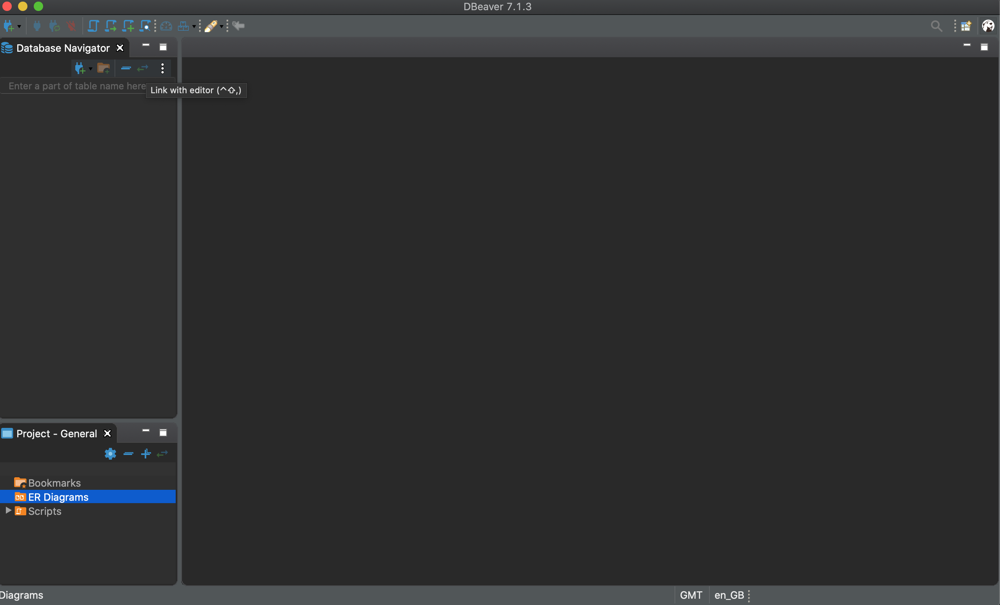
```

If you don't see the `Connect to database` window, click on the `New Database Connection` icon (**plug symbol with a + sign**).

## Connect to database

You should see the `Connect to database` window shown below.

```{r, echo=FALSE, fig.cap="Creating a connection.", out.width = '100%'}
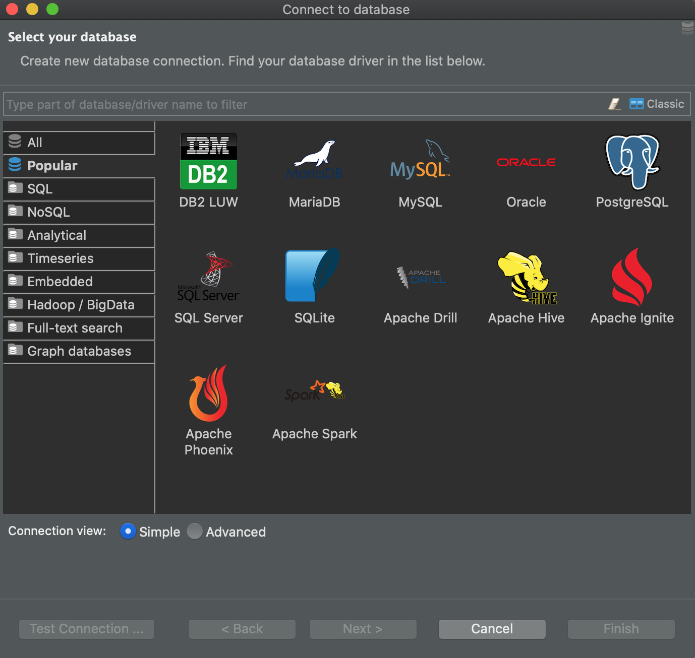
```

Click on the `PostgreSQL` elephant icon, as we are going to connect to a remote `PostgreSQL` database. 

## Enter database connection settings

Enter the database settings shown below into the matching spaces in the form:

**Instructor:** details in plain text for Slack / Zoom chat  

> **Host:** db-postgresql-lon1-20135-do-user-7581050-0.b.db.ondigitalocean.com  
> **Port:** 25061  
> **Database:** zoo_pool  
> **Username:** zoo_user  
> **Password:** nr5jhkjucb1b6yp2  


Connection setting | Value 
------------|--------
Host        |	db-postgresql-lon1-20135-do-user-7581050-0.b.db.ondigitalocean.com
Port        |	25061
Database    | zoo_pool
Username    | zoo_user
Password    | nr5jhkjucb1b6yp2


```{r, echo=FALSE, fig.cap="Entering connection settings.", out.width = '100%'}
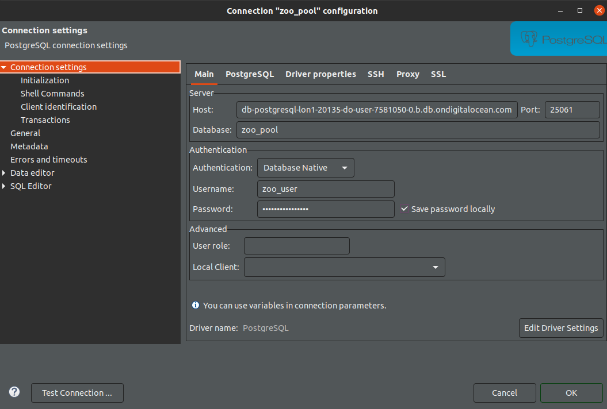
```

Click on `Test Connection`. At this point `DBeaver` may ask you to download drivers, just click `Download`, and then, if necessary, click on `Test Connection` again. If the connection is successful, click on `Finish`. If not, check your connection settings are correct and try again.

## Connect to database

Now you are good to get started! Double-click on the `zoo_pool` connection in the `Database Navigator` pane on the left. After a brief delay, you should see the `zoo_pool` database appear (this looks like a stacked cylinder). Next, click on the `public` schema and you should see a list of the tables in the database: `animals`, `animals_tours`, `care_schedule`, `diets`, `keepers` and `tours`.

**Simple connection view**

Your view of the database may look more complex than this. If so, right-click on the `zoo_pool` connection, and then select `Connection view > Simple`.

```{r, echo=FALSE, fig.cap="Click down through the `zoo_pool` database into the `public` schema to see the tables.", out.width = '100%'}
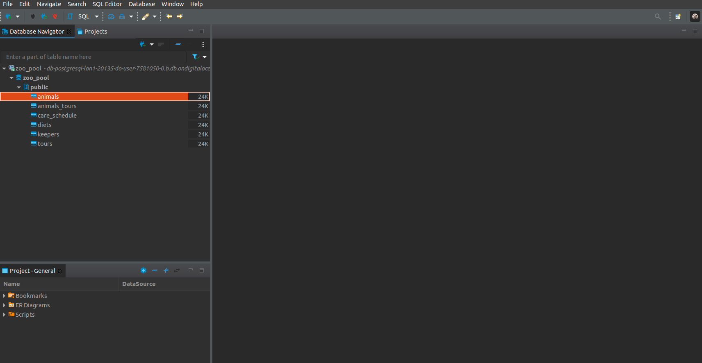
```

## Exploring tables

### Properties

Double-click on the `animals` table and then select the `Properties` tab

```{r, echo=FALSE, fig.cap="Select the `Properties` tab of the `animals` table.", out.width = '100%'}
knitr::include_graphics("images/animals_properties.png")
```

Here you can see the **columns** (AKA **fields**) of the table, their names and data types. We see that `id`, `age` and `diet_id` are **INT** type and `name` and `species` are **VARCHAR** (text) type, with a limit of 50 characters.

### Data

Next, click on the `Data` tab, you will see a tabular representation of the data held, it looks something like a spreadsheet view. This can be very helpful just to get a quick overview of your data! 

```{r, echo=FALSE, fig.cap="Select the `Data` tab of the `animals` table.", out.width = '100%'}
knitr::include_graphics("images/animals_data.png")
```

### Entity relationship (ER) diagram

Finally, select the `ER Diagram` tab, you will see a so-called entity relationship (ER) diagram showing the selected table (`animals` in this case), and its relationship with other tables in the database. In this case we see `animals` is related to the `diets`, `care_schedule` and `animals_tours` tables. 

```{r, echo=FALSE, fig.cap="Select the `ER Diagram` tab of the `animals` table.", out.width = '100%'}
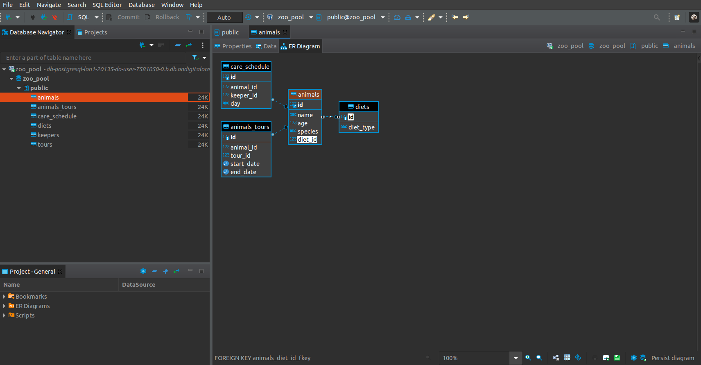
```

Click on the link between `animals` and `diets`: you will see that column `diet_id` in `animals` is linked to column `id` in `diets`. Don't worry about the `care_schedule` and `animals_tours` tables for now: we'll come back to them tomorrow.

<br>
<blockquote class="task">
**Task - 5 mins** 

Perform a similar exploration of the `diets` table. Answer the following questions:

* What columns does the table contain? What are their data types?
* How many rows of data does the table contain?
* What other tables is `diets` related to?

<details>
<summary>**Solution**</summary>

* `id` is an `INT` and `diet_type` is a `VARCHAR(50)`.
* 4 rows.
* `diets` is related to `animals` alone.
</details>
</blockquote>
<br>

## ER diagram for the whole schema

On your way down to see the tables in the `Database Navigator` pane you passed through the `public` schema. By default `PostgreSQL` creates a schema called `public` for every database you create, and places tables within it unless you tell it otherwise.

Double-click on `public` to open the schema, and then select the `ER Diagram` tab, and you will see a useful diagram showing the relationships between **all** of the tables in the schema.

```{r, echo=FALSE, fig.cap="The ER diagram of the public schema", out.width = '100%'}
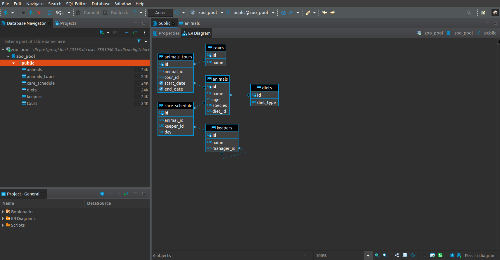
```

# Primary keys and foreign keys

This relationship between the `animals` and `diets` tables is set up by linking `diet_id` in `animals` with `id` in `diets`. Both of these columns are examples of what are known as **keys** in `SQL`. There are two types of key:

| Key | Description |
|---|---|
| Primary | Often the `id` column of a table. A unique value for each row that cannot be blank (`NULL`). The primary key gives us a way to uniquely identify a particular row in a table. |
| Foreign | A column in a table containing the **primary key of another table**. This is what establishes the link between a row in one table, and another row in a second table. |

So: 

* `id` in `diets` is a **primary key**
* `diet_id` in `animals` is a **foreign key**

Let's look at row 1 in `animals`: 

```{r, echo=FALSE, fig.cap="First row of the `animals` table.", out.width = '80%'}
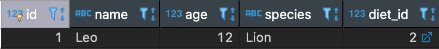
```

We see that the foreign key column `diet_id` contains a value of '2', telling us that Leo the Lion is linked to the row with `id` '2' in `diets`:

```{r, echo=FALSE, fig.cap="First two rows of the `diets` table.", out.width = '40%'}
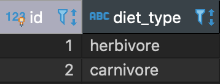
```

So Leo is a carnivore.

**Composite and surrogate keys** 

In data modeling we often distinguish between composite and surrogate keys: 

* Sometimes it may happen that a **combination** of two or more columns naturally forms a primary key (a means of uniquely identifying a row): we would call this a **composite key**. Looking at the `animals` table, we see that the combination of `name` and `species` is a candidate for a composite key.
* More often though we would prefer not to have to work with composite keys (they make `SQL` coding more difficult, can slow queries and annoy software developers working with the database) and so we create an 'artificial' primary key that uniquely identifies each row, but doesn't really tell us anything useful about the entities described by each row: we would call this a **surrogate key**. The `id` column in `animals` is an example of a surrogate key. For example, Leo the Lion has a surrogate key `id = 1`. This value `1` tells us nothing useful about Leo, but does let us find him uniquely in the table.

In `PostgreSQL` we might use a special type `SERIAL` for a surrogate key column: this is just an `INT` that 'auto-increments': every time we `INSERT` a new row into the table, the `SERIAL` increments by 1, giving us a useful primary key.

# Simple queries

Yay! Let's run our first `SQL` query! Click on your connection to `zoo_pool` in the `Database Navigator` pane on the left, and then on the icon above that looks like a piece of parchment with `SQL` next to it, or in the Menus go to `SQL Editor > New SQL script`. You should see a blank editor appear.

The reason we clicked on `zoo_pool` is that these `SQL` scripts are **associated with particular connections**. In effect, `DBeaver` remembers that the script we are about to write should be run using the connection to `zoo_pool`. You will see that `<zoo_pool>` is shown at the top of the script tab.

Let's save your script as `first_script`. Go to `File > Save As` and then enter `first_script` in the `Save As:` box (the `.sql` extension will be added automatically). By default, scripts will save to your home directory. You can either move them later or change where you save them now, as you prefer.

## Changing `SQL` editor defaults 

When typing `SQL` queries, it is common to **capitalise** `SQL` commands to make them stand out from column names and other values. The current dBeaver default leaves the keywords as typed.
To change the default to upper case go to `Window > Preferences...` then in the left hand menu find and click `Editors` to expand the menu, then click `SQL Editor > Formatting`. Change the `Keyword case` option to "Upper".

```{r echo=FALSE, fig.cap = "Selecting uppercase keyword formatting", out.width = '100%'}
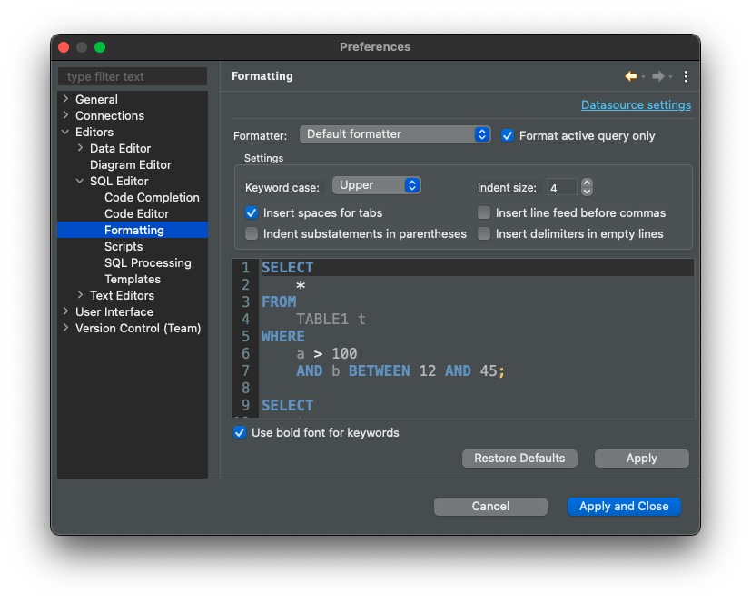

```

Let's also change the Editor settings so that it changes the case of the text we type. In the Menus, just above the `Formatting` menu click the `Code Editor` tab shown below. Check the option `Convert keyword case`.

```{r, echo=FALSE, fig.cap="Changing SQL editor preferences - convert case.", out.width = '100%'}
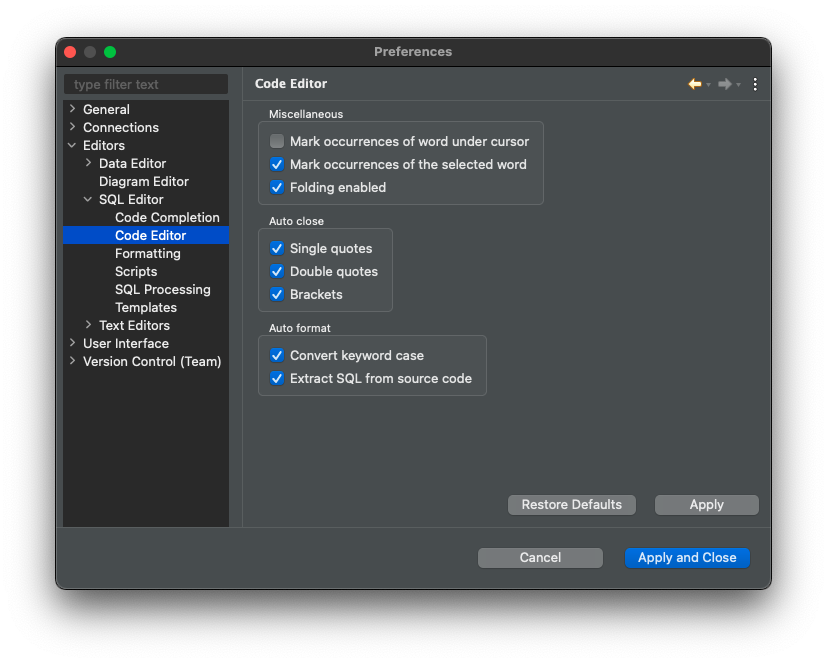
```

Next go to the `Code Completion` tab and uncheck the option `Insert table aliases (in FROM clause)`. This stops `DBeaver` trying to be too annoyingly helpful when we are writing queries by suggesting table aliases (more on this soon). Click `Apply and Close`.

```{r, echo=FALSE, fig.cap="Changing SQL editor preferences - don't suggest table aliases.", out.width = '100%'}
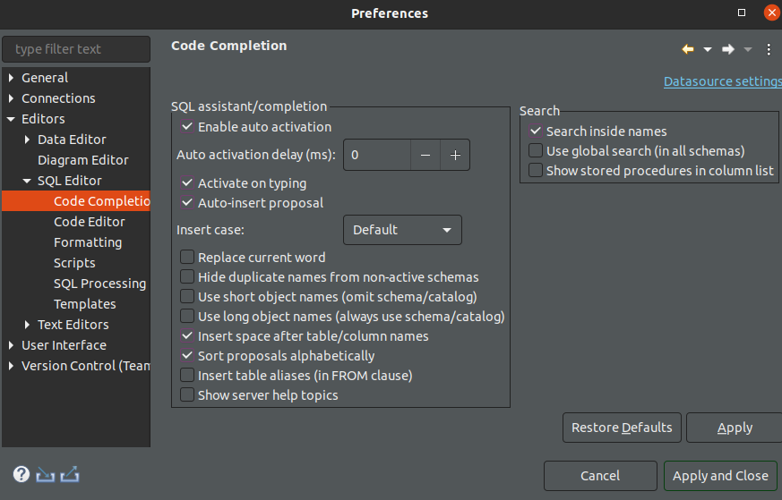
```

```{r, eval=TRUE, include=FALSE, message=FALSE, warning=FALSE}
library(RPostgres)
db = dbConnect(
  Postgres(), 
  host = 'db-postgresql-lon1-20135-do-user-7581050-0.b.db.ondigitalocean.com',
  port = 25061,
  dbname = 'zoo_pool',
  user = 'zoo_user',
  password = 'nr5jhkjucb1b6yp2',
  sslmode = 'require'
)
```

## Back to the query...

Let's write a `SQL` query to return all the rows in `animals`. Back in your `SQL Editor`, type the command below:

```{sql, connection = db, eval=TRUE}
SELECT *
FROM animals;
```

Notice as well that we end the query with a semi-colon `;`. Actually, we don't need to do this in `DBeaver`, but it will be required in some tools, so it makes sense to get used to including it.

Now press the 'Play' button (`Execute SQL Statement`) to the left of the script, or use the keyboard shortcut `ctrl + return`. This will execute the current `SQL` statement your cursor is within; this is usually what you want to do. Sometimes, though, you may have multiple statements in a script. If you want to execute them all at the same time, there is an `Execute SQL Script` button below, this looks like a play button on a roll of parchment.

You'll see the results of the query below. The `SELECT` keyword performs a **Read** operation, as we said in the last lesson. The star `*` after `SELECT` means 'everything' or 'all', but this doesn't refer to **all rows**. Instead, it means **all columns**. We'll talk more about `SELECT`-ing different columns in the next lesson.

`SQL` returns all rows in the table by default. If we want to retrieve only some of the rows, we need to use a `WHERE` clause. This is where our **primary key** column `id` comes in! We can retrieve the record of Tony the Tiger in this way:

```{sql, connection = db, eval=TRUE}
SELECT *
FROM animals
WHERE id = 2;
```

<br>
<blockquote class="task">
**Task - 2 mins** 

Let's try another query to retrieve the record for Ernest the Snake using just the `name` column in the `WHERE` clause. You'll need to put the `name` you want to search for in single-quotation marks, e.g. `'Ernest'`. What's the problem? 

<details>
<summary>**Solution**</summary>

```{sql, connection = db, eval=TRUE}
SELECT *
FROM animals
WHERE name = 'Ernest';
```

There is more than one 'Ernest' and the query returns all matching records. This is why the **uniqueness** of a primary key is important. If we instead retrieved Ernest the Snake's record via

```{sql, connection = db, eval=TRUE}
SELECT *
FROM animals
WHERE id = 7;
```

we can be sure of getting just one row!
</details>
</blockquote>
<br>

Finally, you'll see a little asterisk beside the name of your script in the tab heading, `*<zoo_pool> first_script.sql`. The asterisk indicates you have made changes to the file since you last saved it. Save it now with `File > Save`. 
