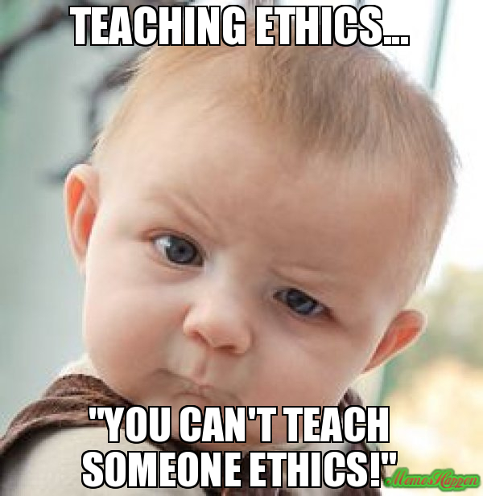
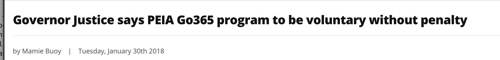

```{r setup, include=FALSE}
knitr::opts_chunk$set(echo = TRUE, fig.align = 'center')
```

Learning objectives:

* Learn what ethics are and why they are important when working with data.  
* Learn about some of the key ethical issues faced in data & technology projects/products.  
* Learn about how working with data can affect individuals and society.   
* Learn about real word examples of each of these ethical challenges.   

***

# What are "Data Ethics"?

Collection and use of data is growing all the time. 90% of the data currently held in the world has been generated over the last 2 years alone[*](https://www.forbes.com/sites/bernardmarr/2018/05/21/how-much-data-do-we-create-every-day-the-mind-blowing-stats-everyone-should-read/#1f1e5ef60ba9). The increased amount and use of data has led to more highly publicised data leaks, data misuse cases, and general security issues. This is why it's increasingly important that ethical considerations are ingrained into any data project or technology. You’re not expected to be able to ‘solve’ all the issues you raise, but by making discussing ethics ingrained in any data project it gets people thinking from day 1 and can change the way that products are shaped. We must train ourselves to envision far-off risk and stretching your imagination because changes come around quickly in tech.  

It's important to remember that it's not all doom and gloom when it comes to ethics. It’s great to be creating tools/technologies that will make a difference. However, in order to pre-empt a  lot of ethical problems, you want to assume a kind of 'worst case' scenario for ethical data discussions. This way, you find where the ethical grey areas are, and can implement solutions before they turn into problems. Often there is no 'right' answer so this lesson is all about discussion!

<br> 

<blockquote class='task'>
**Discussion**

What are ethics?

<details>
<summary>**Answer**</summary>

<br> 

There's no single definition of ethics, but it can be thought of as a system of moral principles (such as our values, principles and purpose) that affects how people make decisions and lead their lives. 

> *"Ethics is knowing the difference between what you have a right to do and what is right to do."* [*](https://www.goodreads.com/work/quotes/27417251-supreme-justice)  

The Open Data Institute defines data ethics as:  

> *A branch of ethics that evaluates data practices with the potential to adversely impact on people and society – in data collection, sharing and use* [*](https://theodi.org/wp-content/uploads/2019/07/ODI-Data-Ethics-Canvas-2019-05.pdf)  


```{r, echo=FALSE, out.width = '50%', fig.align='center'}

```


</details>
</blockquote>

<br> 


***

# Ethical Questions and Considerations


<blockquote class='task'>
**Discussion**

What are some of reasons why data ethics has become such an important issue?

<details>
<summary>**Answer**</summary>


A few reasons:

* New technologies and tools are creating new situations and behaviours that society has not faced before and have no common view on
* More data is being collected that ever before
* Not always a clear understanding of how the technologies are working e.g. ‘black-box' models
* Data sources from different areas are being linked that has never been possible before
* Algorithms/technologies being built are having every increasing impact on society/individuals lives 
* Data and technologies are being used for things beyond their original purpose
* Regulation/law not always there to control the advances (and regulations and laws will vary depending on region and industry). 
* Reputation of the data community and trust of the public in data use.

</details>
</blockquote>


Ethical considerations can be broadly split into 2 groups:

1. Daily practice and consequences - **“Is” and “What if” questions**. Is the data input biased? Is there consent? What if the model is inaccurate? What if there is a data breach? 

2. Ethical norms - **“Should” questions**.  Just because you can do this analysis doesn't mean you should do it. 

<br>


```{r, echo=FALSE, out.width = '40%', fig.align='center'}
knitr::include_graphics("images/can_vs_should.jpg")
```

<br>

Some other overarching questions you can ask yourself when it comes to ethics:

* Would I be happy for this decision to be headlining the news tomorrow? (Sunlight Test)
* What would happen if everybody did this?
* What will this do to my character or the character of my organisation?

But sometimes we have to think beyond our actions and what happens if/when your product scales and we no longer hold full control. 

In this lesson we will discuss some (but not all!) ethical issues that have arisen in the data industry. Keep in mind these ethical questions as we go!


***

# Human rights 

When considering ethics the most important to think about is how algorithms and data technologies can affect fundamental human rights. Human rights are defined as: the basic rights and freedoms that belong to every person in the world, such respect for privacy, no discrimination and right to education and a free election. [*](https://www.libertyhumanrights.org.uk/human-rights/human-rights-act) 

In data, there are a complex range of ethical and legal issues, e.g., equality, privacy and data protection, public security, duty of care to vulnerable members of society, transparency, fairness, justice, proportionality. If people in data are working on technologies that would infringe any human rights, then they need to ensure the fairness of systems, and focus on the importance of not maintaining vigilance of their tech. 

For example:

> In cases where a company deploys a model that turns out to be biased against women (for example), the company could be liable under laws based on human rights. Assigning responsibility to organisations and using the “teeth” of existing enforcement processes is easier with a rights-based approach.
[DataKind UK: Human rights vs Data Ethics](https://medium.com/datakinduk/human-rights-vs-data-ethics-ee2a60e60040)

Everything we will discuss today in some way focuses on basic human rights.   


***

# Bias 

The second big issue in ethics is bias. You may have heard stories of 'bias algorithms' being racist, sexist and making unfair decisions about already vulnerable or discriminated against groups. But what does this mean?

We can define bias as:  

> *'Bias is the action of supporting or opposing a particular person or thing in an unfair way, because of allowing personal opinions to influence your judgement'*[*.](https://dictionary.cambridge.org/dictionary/english/bias)


Data can be biased but so can the people who analyse the data. When data is biased, we mean that the sample is not representative of the entire population. The common definition of data bias is: 

> *'The available data is not representative of the population or phenomenon of study'*


<blockquote class='task'>
**Task**

Can you think of any cases of bias in data that you've heard about?

</blockquote>

The fact is almost all big data sets, generated by systems powered by ML/AI based models, are known to be biased. 


## Gender bias 

Gender bias is when the data or results (or anything really) treats the outcome differently based on what gender you identify with. It's no secret that gender bias is rife when it comes to data. 

<br> 

### Google News: female/male stereotypes


In a highly publicised example it was shown that natural language models (e.g. those that are trained to suggest news articles, identify online reviews, underlie things like alexa, etc..) exhibit female/male gender stereotypes[*.](https://papers.nips.cc/paper/6228-man-is-to-computer-programmer-as-woman-is-to-homemaker-debiasing-word-embeddings.pdf) Females were associated with professions of nurse and nanny whereas males were associated with professions of doctor and financier. 

[You can see this in action at this website.](http://wordbias.umiacs.umd.edu/) An algorithm is used to groups words that have similar meaning to be plotted near each other. When we look at occupations, the relationship between 'he' and 'programmer' is similar to that of 'she' and 'home-maker'. Or if you look at leadership qualities, you see the following:


<br>
<center>
```{r, echo=FALSE, out.width = '80%', out.extra='style="background-color: #008080; padding:5px; align-items: center;"'}

```
</center>
<br>


<blockquote class='task'>
**Task**

Use the tool to look at different categories and words. Share any interesting findings. 

</details>
</blockquote>


### Amazon: Hiring algorithms

<br>
<center>
```{r, echo=FALSE, out.width = '90%', out.extra='style="background-color: #008080; padding:5px; align-items: center;"'}
knitr::include_graphics("images/news_gender_bias.png")
```
</center>
<br>

Amazon created an automated recruitment tool and trained it on data from CVs submitted to the company over a 10-year period. Most of the CVs came from men, a reflection of male dominance across the tech industry. Because of this, their model penalised against CV’s with the word ‘woman’ in it e.g. the term ‘women’s running club’ and against names of all females colleges (even though didn't have the mention of the word 'woman' in it). Although they rectified these difficult to say where proxy for gender being used elsewhere (we will discuss proxies later in the lesson)[*.](https://www.reuters.com/article/us-amazon-com-jobs-automation-insight/amazon-scraps-secret-ai-recruiting-tool-that-showed-bias-against-women-idUSKCN1MK08G)


If you're interested in learning more, you can read the book "Invisible Women by Caroline Criado Perez", which goes into a lot of detail about how our entire data world is biased towards men. [You can find a review here.](https://www.theguardian.com/books/2019/feb/28/invisible-women-by-caroline-criado-perez-review)

<br> 

## Racial bias 

Racial bias is when someone is discriminated against or treated differently (either by a human, system, or model) because of their race. Some of the most well publicised cases of racial bias in algorithmic decision making is in policing and court systems. 


### COMPAS: Police profiling

In the US a risk assessment software powered by AI named COMPAS (correctional Offender Management Profiling for Alternative Sanctions) calculated the likelihood for someone to re-offend. This was then used by judges in the different decisions they make at each stage of the legal process (sentencing, bail amounts, etc.) But, they didn't stop to think that some of the risk assessments might be biased. 

<br>
<center>
```{r, echo=FALSE, out.width = '60%', out.extra='style="background-color: #008080; padding:5px; align-items: center;"'}
knitr::include_graphics("images/compas.jpeg")
```
</center>
<br>


ProPublica, a non-profit news organisation, exposed issues with the software, which contradicted a lot of studies up until that time that said risk assessment scores can be predicted free of racial and gender bias. [You can read the full blog post of the analysis here.](https://www.propublica.org/article/how-we-analyzed-the-compas-recidivism-algorithm)

One example was:

> *'we ran a statistical test that isolated the effect of race from criminal history and recidivism, as well as from defendants’ age and gender. Black defendants were still 77% more likely to be pegged as at higher risk of committing a future violent crime and 45% more likely to be predicted to commit a future crime of any kind'*[*.](https://www.propublica.org/article/machine-bias-risk-assessments-in-criminal-sentencing)


The builders of the software have defended it's accuracy but wouldn't release how they calculated the scores (as is proprietary) so there is a limit to how much can say about it's fairness. Even if the intentions were good in building the tool, in that it was believed it would remove potential human bias, this unfortunately has not been the case and has been relied upon too heavily as an 'unbiased sorce of truth'. 

Another issue of bias is it can cause self-fulfilling feedback loops. Take policing for example... Police forces now use algorithms to calculate which areas are high risk and so are likely to send more resources to these areas. If you have concentrated resource in this area you are more likely to catch any crimes here quicker, even though similar crimes could be happening in other areas where police aren't present. This becomes self fulfilling because the results provide 'proof' that there are in fact more crimes in this area and so it continues to be a high risk area. 

<br> 

### UK Gangs Matrix

An example of a similar issue in the UK is the Gangs Matrix. 

> *'a controversial database created by the Metropolitan Police (the Met) in the aftermath of London’s 2011 riots to purportedly identify and watch those at risk of committing gang-related violence, and their associates. It uses a number of data points including previous offences, social media activity and online friendship networks'.*

<br>
<center>
```{r, echo=FALSE, out.width = '70%', out.extra='style="background-color: #008080; padding:5px; align-items: center;"'}

```
</center>
<br>


But human rights charity Amnesty International has heavily criticised the database, saying

> *'35% of those on the matrix had no police intelligence linking them to gang violence and had never been charged with a crime. Sharing certain YouTube videos of grime or drill music, meanwhile, is considered a key indicator of gang affiliation.'*[*](https://www.wired.co.uk/article/gangs-matrix-violence-london-predictive-policing)    

The Information Commissioner’s Office (ICO), Britain’s watchdog for data use, ruled that the matrix breached data protection rules[*.](https://www.wired.co.uk/article/gangs-matrix-violence-london-predictive-policing)


### White Collar Crime

Racial bias predominantly discriminates against non-white human beings. To date, there is not one highly publicised example that has shown white, male individuals to be negatively affected by data bias. 

However, this app was presented at the Strata Data Conference in NYC in 2017. The [White Collar Crime Risk Zones](https://whitecollar.thenewinquiry.com/) is a predictive policing application that targets white collar crime. It flags areas high risk of white colour crime and then scrapes LinkedIn data to predict what the person may look like . The app  uses industry-standard predictive policing methodologies which are used by police to target “street” crime[*.](https://thenewinquiry.com/white-collar-crime-risk-zones/). The makers were making a point when they said: 

> Unlike typical predictive policing apps which criminalize poverty, White Collar Crime Risk Zones criminalizes wealth.

[You can play around with the app here!](https://whitecollar.thenewinquiry.com/)

<br>
<center>
```{r, echo=FALSE, out.width = '70%', out.extra='style="background-color: #008080; padding:5px; align-items: center;"'}

```
</center>
<br>


<br> 

## Bias task


<blockquote class='task'>
**Discussion**

[Consider the following news story...](https://www.telegraph.co.uk/news/2019/09/27/ai-facial-recognition-used-first-time-job-interviews-uk-find/)

* Companies are using AI technology to analyse the language, tone and facial expressions (e.g. brow furrowing, eye widening or closing, lip tightening, chin raising) of candidates when they are asked questions which they film on their mobile phone or laptop.
* The companies get about 25,000 data points from 15 minutes of video per candidate to get a data set of “how someone is responding, the emotions and cognitions they go through.”
* Firm claims ‘more reliable and objective indicator of future performance free of human bias’ than reviewing CVs.
* Assessing their performances against about 25,000 pieces of facial and linguistic information compiled from previous interviews of those who have gone on to prove to be good at the job.

In your groups think of some potential ethical risks here.


<br>
<center>
```{r, echo=FALSE, out.width = '60%', out.extra='style="background-color: #008080; padding:5px; align-items: center;"'}
knitr::include_graphics("images/news_face.png")
```
</center>
<br>


<details>
<summary>**Solution**</summary>

Some potential issues (but not constrained to)

* Dataset that used to train the model may have had bias in it. 
  1. If there was any human bias in past hiring in the past would have filtered through into dataset. 
  2. If any bias in promoting/success within a firm that would impact who was in ‘successful’ dataset. 
  3. What is their definition of success? Is doing a good job ‘getting many new sales’ or ‘creating long lasting relationships with few clients’ - can differ. Also many reasons a someone who is ‘good candidate' but didn’t go on to be successful in a particular role, and vice versa. 

* Could be discrimination due to facial features - if blink more when get nervous, or even facial disabilities. Could also be facial feature recognition bias due to face shape, skin colour etc. depending on the diversity of the dataset it has been trained on. 
* Potential discrimination with accent or regional wording?
* Consent 
  1. Will the data be removed after the interview or will it be stored and looked at if reapply? 
  2. Is data potentially going to be used for any other purposes?
  3. Is the data being held by the potential employer only or the company who owns the software (as these are separate)? 
  4. People who really want/need a job willing to give away their facial data because would give away their data for chance of getting a job (fair consent or imbalanced power)? 


</details>
</blockquote>


## Dealing with bias 

Dealing with bias is notoriously difficult. If the data you have is biased, it really doesn't give you a strong starting point. You may be thinking 'if a variable is causing bias then we could just remove it'. But where do you draw the line? You can't just remove all the variables you think might cause bias because they may hold predictive power and you could end up with no variables left. 

The other problem is that there may be other variables that could be 'proxies' for sensitive characteristics.  For example if we remove ethnicity or religion from a model build but keep name in then it could end up being a proxy for these as names can often be reflect different ethnicities. Such as in the following case[*](https://www.thesun.co.uk/motors/5393978/insurance-race-row-john-mohammed/):

<br>
<center>

```{r, echo=FALSE, out.width = '70%', out.extra='style="background-color: #008080; padding:5px; align-items: center;"'}

```

</center>
<br>

Proxies are a really important topic, and even can revolve around legal issues. For example, it is actually illegal to use gender to model credit risk in financial services. So you need to think carefully about what you are doing, and there isn't really a clear cut answer or guide on what to do in most cases. 

Proxies will be covered more in during predictive modelling lessons. 


## Remember: algorithms aren't biased

Throughout these examples it is important to think about how these algorithms are created. Often the news will report about 'racist algorithms' but it is not the algorithm themselves. It is the data that is used to train them that causes the bias. And this data is created based on decisions or opinions people have had. 

This data collected by humans - which is full of bias already - is then used to 'train' a model. That model is then tested on data we already have, to see how accurately it can predict the outcome of some part of it. Once it performs well, it is released "into the wild" to work on data it has never seen. The important part is that the algorithm learns all it's patterns from the existing data, and then goes and tries to apply that to the wider world. 


Cathy O'Neil, author of Weapons of Math Destruction, states

> *'Algorithms are opinion embedded in code ... they repeat past patterns and apply them blindly.* 

> *'AI learns about how the world has been. It doesn’t know how the world ought to be. That’s up to humans to decide.'*[*](https://www.vox.com/science-and-health/2017/4/17/15322378/how-artificial-intelligence-learns-how-to-be-racist)

The issues you see in the news usually arise because algorithms (once they are released) are often left to their own devices with little monitoring. They apply past things they've learned to a new world, and this can often result in the biases. 

A more recent example we might all be familiar with is the case that arose when the school aged children had their exams cancelled due to COVID 19. 

<br>
<center>

```{r, echo=FALSE, out.width = '70%', out.extra='style="background-color: #008080; padding:5px; align-items: center;"'}

```

</center>
<br>

It turned out that Scotland's poorest schools were four times more likely than the private schools to have higher results automatically marked as a fail rather than a pass. According to one academic, the data shows that the system originally in place to award 2020 exam results was “biased against the teacher judgements of socially deprived students”[*.](https://www.thenational.scot/news/18802660.revealed-poorest-scots-schools-hit-four-times-harder-sqa-results-scandal/)

What happened here? The algorithm itself wasn't biased - it can't be. It was the data it was using to learn that was biased. The downgraded results were due to a combination of factors relating to the school itself (% of children on free school meals, past overall exam rates, and overall deprivation rates of the postcode) rather than the individual student performance. 

The results of the algorithm were ditched within a week and the results adjusted, but it's a great example of the pitfalls that can happen when you rush through creating algorithms and don't properly check the output! 


***

# Data collection, storage and minimisation 

One set of topics that tie into everything we've taked about so far is collection, storage, minimisation and annoynmisation. These topics tie into everything we've just talked about. Often there is a risk when collecting data that we collect as much information as we can 'just in case we need it later'. It can be tempting to just ask an extra application question or to track one extra on-line activity. But there are a few things to think about here. 

## Data minimisation & GDPR 

> *'Data minimisation is a privacy principle that requires the people collecting data to be intentional about what type of data is collected and how long it is retained ... we should limit data collection to what is directly relevant and necessary to accomplish a specified purpose.
Data minimisation also refers to de-identification practices in which PII (personally identifiable information) is stripped out of data sets before they are shared with others or made accessible to the public.'* [*](http://elan.cashlearning.org/wp-content/uploads/2016/05/Data-minimization-tip-sheet.pdf)

However there is a risk that people can be scared about holding any information on customers/users, especially after the launch of GDPR, and to the extreme delete almost all information they hold. Data can be critical for organisations to understand their impact and enable them to make their organisations more effective, so there is a balance to be found. 

GDPR is good because more regulation is needed when it comes to data generally but it should not be seen as a reason not to collect data. The purpose of GDPR is protecting people's data and ensuring consent for what it can be used for but not not to collect any.

>*'GDPR is not easy ... there isn’t a one-size-fits-all guide to implementation.'*[*](https://blogs.ncvo.org.uk/2018/05/22/gdpr-dont-press-the-delete-button-just-yet/)


## Data storage

Data storage involves thinking about how and where you're going to keep the data secure. Tech companies should consider different options such as aggregating data and regularly reviewing the need for the data they are storing. Some aspects you need to think about:

* **Security**: Need to ensure that all this data is only accessible by relevant people, particularly if is potentially sensitive. Also need to consider the risk of data breaches - accidental data leakage/loss can be even more damaging for the reputation of a company than knowingly selling it on to a questionable third party.

* **Consent**: Under GDPR you are responsible, upon request, to declare all the information you hold on someone and/or to delete all that information. So the more data collect the more complex these deletions or information requests can be. 

* **Timing**: You also need to consider reasonably, or even legally, how long you should be storing this data. 

* **Environmental**: An often overlooked consideration is the impact of storing data on the environment. Storing and processing large volumes of data uses large amounts of energy. Aside from the electricity needed for data centres to run they also require constant cooling as they generate massive amounts of heat. A 2015 report found that data centres cause 2% of global greenhouse gas emissions, the same as the aviation industry[*.](https://www.theguardian.com/environment/2015/sep/25/server-data-centre-emissions-air-travel-web-google-facebook-greenhouse-gas) Research predicts that by 2040 this could increase to 14%. [*](https://www.theguardian.com/environment/2017/dec/11/tsunami-of-data-could-consume-fifth-global-electricity-by-2025)


## Anonymisation 

The ability to link multiple data sets and to use them to identify individuals is a growing problem.

> *'Anonymised data means that all identifiers have been irreversibly removed and data subjects are no longer identifiable in any way...information is fully anonymised if there are at least 3-5 individuals to whom the information could refer.* [*](https://www.ed.ac.uk/records-management/guidance/checklist/anonymisation)

For example, if your data has information on gender, ethnicity and postcode and for some combinations there are less than 4 people in a category then you could use only the first 3 digits of the postcode to allow the number of people in each category to increase. But the counter argument here is if you aggregate at too high a level or remove too much information then the data is no longer useful to analyse.

Furthermore there has been research that 'impossible for researchers to fully protect real identities in datasets' [*](https://www.theguardian.com/technology/2019/jul/23/anonymised-data-never-be-anonymous-enough-study-finds). Additionally there is an issue.


## Data gaps 

When working on projects it's not just important to report on what data you have, but also what data you don't have or what might be missing from the data you do have. [This](https://www.nesta.org.uk/blog/mind-gap-between-truth-and-data/) blog from Nesta, a UK innovation foundation, highlights this area very well. 


***

# Consent, Context, Timeliness, and Privacy

Our next topic that is a huge one in data ethics is that of privacy and consent. We should now all be familiar with the popups you get when you visit websites, asking you if you consent to cookies and tracking data... 

<br>

```{r, echo=FALSE, out.width = '50%', fig.align='center'}
knitr::include_graphics("images/cookies-meme.jpg")
```

<br>

More and more companies in different industries are using non-traditional data sources such as our location data, social network and on-line posts, to predict risks that would have previously deemed unrelated. Some of these sources can be potentially sensitive data and the ability to link these many previously isolated areas together needs consideration of the ethical consequences of this, particularly around consent, context, and timeliness.

Note: these are not only issues that involve algorithms. Everyday data analysis on data collected from human beings should be scrutinised to the same standard. 

Some questions to ask yourself when designing or reviewing analysis:

* **Consent**: Data and consent is often for a particular type of analysis. Do you have consent to use this data for your current analysis task? Was the consent taken for a different project? Does the individual know it's being used by other companies and for other projects? Has this consent been clearly communicated or is it tucked away in a 100 page terms and conditions document written in legalese? Should there be a responsibility to make it clear and easy to understand? A survey may have been carried but in exchange for financial reward, could this mean that the demographic of the survey audience may be skewed because of this and/or they may be motivated to answer in a particular way.

* **Context**: Does the customer know their data is being used in this way? For example, do they know location data is being used to calculate whether they are eligible for a mortgage? Do they know their medical history is used to calculate your life insurance premiums? How do we know what data sets are acceptable to use in each context? Often data can be from 3rd parties - what source is it form, is it credible and reliable source?

* **Timeliness**: What happens if data being used is incorrect or out of date and being used to make a decision for someone? Without transparency of what is being used to do each calculation we will not know. If if we did know how can people request to correct the information? Is there a way to opt-out of any data collection for automated systems? When was the data collected and is it current enough for your task?

* **Privacy**: Who consented to the data? How is the data being kept safe? Is it guaranteed that you can't be identified from all this data being aggregated from different sources?  


Keep these different aspects in mind as we go through the following case studies. 


## Social media and car insurance

<br>
<center>

```{r, echo=FALSE, out.width = '70%', out.extra='style="background-color: #008080; padding:5px; align-items: center;"'}
knitr::include_graphics("images/news_fb_car.png")
```

<br>
</center>

Insurance company Admiral was forced to stop plans to use their customer's Facebook posts to analyse the personalities of car owners and set the price of their insurance after Facebook said the scheme breached its privacy rules[*.](https://www.theguardian.com/technology/2016/nov/02/admiral-to-price-car-insurance-based-on-facebook-posts)


> Admiral Insurance will analyse the Facebook accounts of first-time car owners to look for personality traits that are linked to safe driving. For example, individuals who are identified as conscientious and well-organised will score well.


<blockquote class='task'>
**Discussion**

What are the ethical issues here?


<details>
<summary>**Solution**</summary>

Some, but not all of the issues are:  

* People don't know their data is being used for this when they sign up for Facebook  
* Social media isn't actually usually a good indicator of who you are  
* A good personality doesn't actually make you a good driver  
* No consideration of actual driving abilities when making a quote  
* Data is being sold on and used without consent or proper context  

</details>
</blockquote>

<br>


## Government surveillance

<br>
<center>

```{r, echo=FALSE, out.width = '70%', out.extra='style="background-color: #008080; padding:5px; align-items: center;"'}

```

</center>
<br>

The Home Office secretly acquired sensitive data, which was set up and collected by charities to create a database set up to help support rough sleepers and help policy-makers “identify emerging needs”. The data showed the nationality of people sleeping rough on the streets, and using their newly introduced guidance which enables immigration enforcement teams to deport EU nationals solely on the grounds that they are sleeping rough, they used this data to deport EU nationals[*.](https://www.theguardian.com/uk-news/2017/aug/19/home-office-secret-emails-data-homeless-eu-nationals)

<br> 

<blockquote class='task'>
**Discussion**

What are the ethical issues here?

<details>
<summary>**Solution**</summary>

Some, but not all of the issues are:  

* Data is being used for a purpose it wasn't collected for  
* Context has changed: was collected for protection, now used for deportation  
* The individuals involved didn't consent to their data being used this way, and have no control over it  
* Sensitive information is collected and stored (gender, mental health status, nationality) and shared  
* Maps and data are not in the public domain and not open access, so no clue how and who is using the data  

</details>

</blockquote>

<br>


## Predicting employee illness

<br>
<center>

```{r, echo=FALSE, out.width = '70%', out.extra='style="background-color: #008080; padding:5px; align-items: center;"'}
knitr::include_graphics("images/news_work_ill.png")
```

</center>
<br>

As US health care costs continue to grow, some companies are paying third party firms to collate and analyse employee data (including where they shop, whether they vote etc.) to identify health risks in their workforce. For example, data is being used which workers are at risk for diabetes and target them with personalised messages nudging them to about exercise and health advice[*.](https://www.wsj.com/articles/bosses-harness-big-data-to-predict-which-workers-might-get-sick-1455664940)

> *'I bet I could better predict your risk of a heart attack by where you shop and where you eat than by your genome.'*[*](https://www.cebglobal.com/talentdaily/can-predict-employees-will-get-sick/) 

<br> 

<blockquote class='task'>
**Discussion**

What are the ethical issues here?

<details>
<summary>**Solution**</summary>

Some, but not all of the issues are:  

* Financial incentives / penalisations will disporportionally affect those in need of money  
* Financial situation might void consent - if you need the money you might just consent, but it's not entirely voluntary as you might not do it if you didn't need the money  
* No clue where the data is going after they collect it and use it to judge your health  
* You might be willing to sell the fitness data for lower premiums when you're healthy. But what if you go out tomorrow and get hit by a car? What if you got long COVID? Neither of these are your fault, but you'd be liable for the expensive premiums  
* It is biased towards healthy people and those with no pre-existing conditions  
* What about people with disabilities? What about those who have diabetes from birth? Why should they be penalised?  


</details>

</blockquote>

<br>


## Work wellness programme and health insurance

In a similar field to the example above we are seeing health or life insurance companies offering lower insurance premiums for the agreement you will wear a health tracking device and maintain a certain level of exercise. 

However in  West Virginia teachers went on strike due to their health insurance enforcing a programme like this. They were told to download an app on their phone, which would track their steps and in turn earn points. If they didn’t earn enough points then they were penalised financially. And if they chose not to use the app they were also penalised financially[*.](https://www.theguardian.com/commentisfree/2018/mar/07/west-virginia-teachers-strike-healthcare)

<br>
<center>

```{r, echo=FALSE, out.width = '90%', out.extra='style="background-color: #008080; padding:5px; align-items: center;"'}

```

</center>
<br> 

In 2016 courts ruled it legal to exclude employees from group health insurance if they refuse to participate in wellness programs but after the strikes it became voluntary for the teachers[*.](https://wchstv.com/news/local/governor-justice-says-peia-go365-program-to-be-voluntary-without-penalty)

<br> 

<blockquote class='task'>
**Discussion**

What are the ethical issues here?


<details>
<summary>**Solution**</summary>

Some potential issues (but not constrained to)

* Not necessarily totally accurate of your wellness. 
* May do other exercise not collected via a FitBit
* Other factors affect health - diet, stress, social interactions, environment etc.  
* You may be happy to wear a FitBit when you are healthy as will benefit from lower premium for health insurance from sharing this data, but what happens if you suddenly fall ill? Then you could be fined or increase premiums because locked into agreement due to constant monitoring.
* What else could this data be used for? Is it tracking location etc? 
* Risk it could be sold on to third parties. 
* Risk could be discriminated by employees for not being ‘well’ enough. 
* Employer influence on the employees life and control employees behaviour?

</details>
</blockquote>


***


#  Targeted information

The widespread reach of technology makes the ability to share and spread news or information easier than ever before and the mediums people are getting their information from is changing. However the lack of regulation in many of these new mediums also allows for targeted information and subverted truths (such as fake bots) which can lead to increasing divides within society. 


## Targeted news 

The term 'fake news' has become commonplace after the Trump era. But what does this actually mean? There is a difference between targeted and fake news. The latter is obviously unethical and easy to dismiss. But what about targeted news? That is entirely legal, but ethically questionable. There is concern that people will be closed off to different views and opinions because on-line feeds can create “echo chambers,” where users see posts only from like-minded friends and media sources. 


An example people may have been familiar with was the targeted news campaign and ads ran by the Vote Leave campaign[*.](https://www.bbc.co.uk/news/uk-politics-44966969)


<br>
<center>

```{r, echo=FALSE, out.width = '70%', out.extra='style="background-color: #008080; padding:5px; align-items: center;"'}

```

</center>
<br>


The ads were created by Canadian company Aggregate AIQ, and focused on specific "hot topic" issues, such as immigration or animal rights. Essentially, anything they thought likely to push the buttons of certain groups of people, based on their age, where they lived and other personal data taken from social media and other sources which could be shown to each group and sway them to vote one way or another. 

The adverts contained in the Facebook data set were seen more than 169 million times in total. In 2018 the Electoral Commission ruled that Vote Leave broke electoral law by working jointly with another campaign, BeLeave - something denied by both groups.


<blockquote class='task'>
**Discussion**

What are the ethical issues here?


<details>
<summary>**Solution**</summary>

Some, but not all of the issues are:  

* People don't know they are being targeted  
* People don't get balanced viewpoints  
* It's hard for people to decipher what is an echo chamber and what is real if they're never exposed to other information  
* People might not understand that Facebook only shows them what Facebook wants to show them  
* What data are they using to classify what ads people get shown?  


</details>
</blockquote>

<br>

One interesting counter point to all this is to consider if we ever really had a non-biased view of the news? How does targeted news via facebook compare to eople reading a single newspaper source in the past? What about only watching a particular news channel? What about only hanging out in groups or with friends that have similar word views to you?  

Former Google Data Scientist, Seth Stephens-Davidowitz, argued that people are actually more likely to be exposed to views very different from theirs via the internet/social media rather than before these were around, because your Facebook friends are much greater than the circle of people than you usually spend your time with. [*](https://www.businessinsider.com/seth-stephens-davidowitz-everybody-lies-politics-echo-chambers-offline-internet-2017-7?r=US&IR=T)

Food for thought!


## Targeted advertising   

It is well known that Facebook allows advertisers to target users based on their interests or backgrounds, but it's tool also allows them to **exclude** based on certain categories, including predicted ethnicity. 

In the US adverts that exclude people based on race, gender and other sensitive factors are prohibited by federal law in housing and employment (Fair Housing Act), which is why in March 2019 the Department of Housing and Urban Development filed charges against Facebook for housing discrimination. [*](https://www.theverge.com/2019/3/28/18285178/facebook-hud-lawsuit-fair-housing-discrimination)

<br>
<center>

```{r, echo=FALSE, out.width = '70%', out.extra='style="background-color: #008080; padding:5px; align-items: center;"'}

```

</center>
<br>

ProPublica first raised concerns over housing discrimination on Facebook in 2016, when reporters found that the “ethnic affinities” tool could be used to exclude black or Hispanic users from seeing specific ads. 

> “[Facebook] has provided a toggle button that enables advertisers to exclude men or women from seeing an ad, a search-box to exclude people who do not speak a specific language from seeing an ad, and a map tool to exclude people who live in a specified area from seeing an ad by drawing a red line around that area,” the complaint reads.

If those ads were for housing or employment opportunities, the targeting could easily violate federal law. At the time, Facebook had no internal safeguards in place to prevent such targeting.


<blockquote class='task'>
**Discussion**

What are the ethical issues here?


<details>
<summary>**Solution**</summary>

Some, but not all of the issues are:  

* What does someone's ethnicity or race have to do with their ability to do a job?  
* Choice is taken away - if someone can't see a house or a job, how can they apply?  
* Companies are excluding diversity by choosing specific pre-screening options  
* Where you live might have nothing to do with who you are - might have inherited a house, staying with a parent to care for them, staying close to a partner, etc.  


</details>
</blockquote>


***


# Automation


In the context of automation, ethics warns us against mass unemployment, lack of control over decision-making procedures, and the scary scenario where the bots are smarter than humans and begin to communicate with each other in ways incomprehensible to human beings. But is this really the direction we're heading? 


## Self-driving cars

One notable example of such an ethical topic is that of self-driving cars. On one hand, it is suggested that these cars can contribute to considerably safer traffic and fewer accidents, as these vehicles will be able to respond much faster and more reliably than fallible human drivers. However, they also raise ethical questions about how to prioritize human lives in situations where either people inside or outside the car will die. What should autonomous , self-driving cars be programmed to do in a situation where five children have entered the road in front of the car and the choice is continuing straight ahead, killing the children, or steering the vehicle out of the road and into a concrete wall, with the result that the car is damaged and the one person inside it dies? These are the kinds of situations that car manufacturers and their programmers are pondering.


<br>
<center>

```{r, echo=FALSE, out.width = '70%', out.extra='style="background-color: #008080; padding:5px; align-items: center;"'}

```

</center>
<br>

In March 2018 a pedestrian died in Arizona from a test of Uber's driverless car. The fatal accident is said to have occurred as a result of the automated Uber not having "the capability to classify an object as a pedestrian unless that object was near a crosswalk" - NTSB. 

> Because the car couldn't recognize Herzberg as a pedestrian or a person — instead alternating between classifications of "vehicle, bicycle, and an other" — it couldn't correctly predict her path and concluded that it needed to brake just 1.3 seconds before it struck her as she wheeled her bicycle across the street a little before 10 p.m.

As a result, both Uber and Toyota paused their testing programs. But given that road-violence is the number one killer in the world, with just in the US 100 people a day dying from car crashes, with over 17,000 crashes a day [*](https://www.iii.org/fact-statistic/facts-statistics-highway-safety), isn't this an acceptable occurrence? What is a relative acceptable amount of deaths caused by driverless cars?  [*](https://qz.com/1233563/ubers-first-self-driving-car-death-raises-questions-about-acceptable-levels-of-autonomous-vehicle-safety/)

Just because we're so used to the idea that cars dominate the world, and road-traffic collisions are seen as "accidents" more often that not because they're so frequent, does that mean we shouldn't test out automated products that would reduce this? 
Imagine if the news reported the car crashes caused by humans on a daily basis with the fury and uproar it does with accidents by driverless cars? Would we perhaps feel someone had to be done? 

The odds are that it will take a lot longer to arrive at autonomous cars, possibly never getting there at all. But it raises important ethical issues to consider. 


<blockquote class='task'>
**Discussion**

What are the ethical issues here?


<details>
<summary>**Solution**</summary>

* Who owns the technology and data? If the tech is patented and protected by the rich, only those with the means could afford such a car  
* Who decides who lives and dies in a road accident? Is it the algorithm? Will there be an override button?  
* What happens if there is an override button and the driver of the car tries to ensure their life is protected? Would it work?  
* Would there be a black market for software to override the code in the car to always protect the driver? Given how entitled and terrible the bad drivers currently are, would this become a new form of crime?  
* What control do people not in the car have over their safety? How do they consent to their data being collected by the car?  
* Who would own the data the car stores about its environment and the world around it?  

</details>
</blockquote> 


## Government Automation

So many decisions made by government bodies can have such a huge impact on people's lives - housing, benefits, health services etc. And given the 


<br>
<center>

```{r, echo=FALSE, out.width = '70%', out.extra='style="background-color: #008080; padding:5px; align-items: center;"'}
  
```


</center>
<br>

The Department for Work and Pensions (DWP) are developing automated tools to handle benefit claims, such as childcare and housing, and to predict whether they are true. 

While they believe it will allow claims to be handled more quickly and accurately there are concerns that the government is 'accelerating the automation of the welfare system without a proper evidence-based consultation about its impacts'. DWP has refused freedom of information requests to explain how it gathers data on citizens. [*](https://www.theguardian.com/technology/2019/oct/14/fears-rise-in-benefits-system-automation-could-plunge-claimants-deeper-into-poverty)  

<blockquote class='task'>
**Discussion**

What are the ethical issues here?


<details>
<summary>**Solution**</summary>

* How does the algorithm classify a false claim?  
* Would a human ever intervene if the result was wrong?  
* Where does the data go once it's been used?  
* How do you know what is predicting the validity of your claim?

</details>
</blockquote> 


## Explainability and understanding of models 

As models get more complex and automatic, the understanding and explainability of how a model works becomes an ethical risk. With some 'black-box' models it is not so easy to interpret. 

There often needs to be a weigh up between additional accuracy that 'black-box' models can sometimes have over the lack of ease to understand how it is working for people making the business decisions. 

Cathy O'Neil states people *'both fear and trust maths'* but again, should come back to the fact that algorithms are not just an equation, they are built on data and have different levels of human influence (such as variables chosen to initially build the model and the definition of success). 


***

# Use of public data 

Data that is publicly available (e.g. anything on the web) is not the same as open data. Open data is data that *anyone can freely use, re-use and redistribute them, for any purpose, without restrictions.* but different legal, regulatory and ethical considerations apply to information on the internet.

Many different restrictions may apply to data extracted from APIs, such as you may not be able to retain any copies of the data extracted and/or you can’t add or link it to any data you already hold - but without full transparency of data being used in different technologies who is policing or checking these restrictions? Many websites also have restrictions on text mining the information on the webpage (even for personal use) without their authorisation.

## Twitter / Samaritans 

<br>
<center>

```{r, echo=FALSE, out.width = '80%', out.extra='style="background-color: #008080; padding:5px; align-items: center;"'}
  
```

</center>
<br>

Samaritans developed an app which monitored Twitter accounts for tweets indicative of possible depression or suicidal thoughts (based on specific keywords). A concerned friend or family member could sign up and would then send them an email if the content of the person's tweets suggests that they are vulnerable.

Samaritans had pre-empted concerns about the use of Twitter data by stating in it's descriptions that *'all the data used in the app is public, so user privacy is not an issue'*[*.](https://www.theguardian.com/technology/2014/oct/30/suicide-samaritans-radar-will-save-lives-twitter) But there were a lot of privacy concerns raised that even though the data was in the public domain that they were surveilling people’s tweets without their permission and more seriously that it actually breaches the Data Protection Act 1998 (that has now been replaced by GDPR), leading the app to be suspended. 


<blockquote class='task'>
**Discussion**

What are the ethical issues here?


<details>
<summary>**Solution**</summary>

Some, but not all of the issues are:  

* People don't know their tweets are being used to monitor their mental health  
* Anyone can sign up and report the person's data without their consent  
* People might not realise that what they say could come up later in searches related to their medical records  
* What happens if someone from Samaritans is worried? Can they call the police and send someone to your house?  
* There is no way to take into account the context of the tweet  


</details>
</blockquote>

<br>


***


# Value for your data 

The final thing to consider when it comes to data ethics is how valuable this business is. Companies are gaining value from your information, either by selling it on to third parties or using it to make their products or services better and so generating more income. People often view services such as social media as free, but are you just paying with your attention and data rather than money? And will there come a time when consumers will get some value for the data they are giving away? 

In 2018, Facebook generated $55 billion in advertising revenue, while Google posted more than $116 billion in the same period[*.](https://qz.com/1655610/how-can-you-measure-the-worth-of-your-data/) Some of this advertising comes from allowing advertisers to target customers based on characteristics that are calculated from user's data. 

Do you see it less invasive monetisation of customer data if you think it’s the same as supermarket loyalty card tracking shopping data and targeting you with paper adverts posted through your door? This has been going on for years. 

Could consumers retain control and ownership of their data, allowing the consumer to manage it and sell/exchange it as they wish to companies? Will eventually ee get more/less value dependant on how ‘useful/full’ our data is? Business models may change to reflect this. 

Chris Hughes, the co-founder of Facebook who is now an outspoken critic of the company, proposed the idea of a 5% tax on companies that use consumer data that could generate at least $100 billion per year, which would be distributed to citizens. He compared this to the way revenue from oil extracted in Alaska is distributed to the state’s citizens, amounting to about $1,500 per person per year[*.](https://qz.com/1655610/how-can-you-measure-the-worth-of-your-data/)

But other's argue these ideas just detract from the fundamental human right of privacy and even if customers were compensated by money the right persists.  


***


# Additional resources 

* [Black mirror scenarios](https://docs.google.com/presentation/d/1fZah6nYpAhLtUMh1BRy3w1vCHk_-W7bxxv0LeuKZpT0/edit#slide=id.g63d578e5a7_0_155)
* [Should this exist podcast](https://shouldthisexist.com/)
* [EdX data science ethics online course](https://www.edx.org/course/data-science-ethics-0)
* Lots of books - including Cathy O'Neil and Hannah Fry  
* [Organisation working for Universal Basic Data Income](https://www.ubdi.com/individuals/how-it-works)
